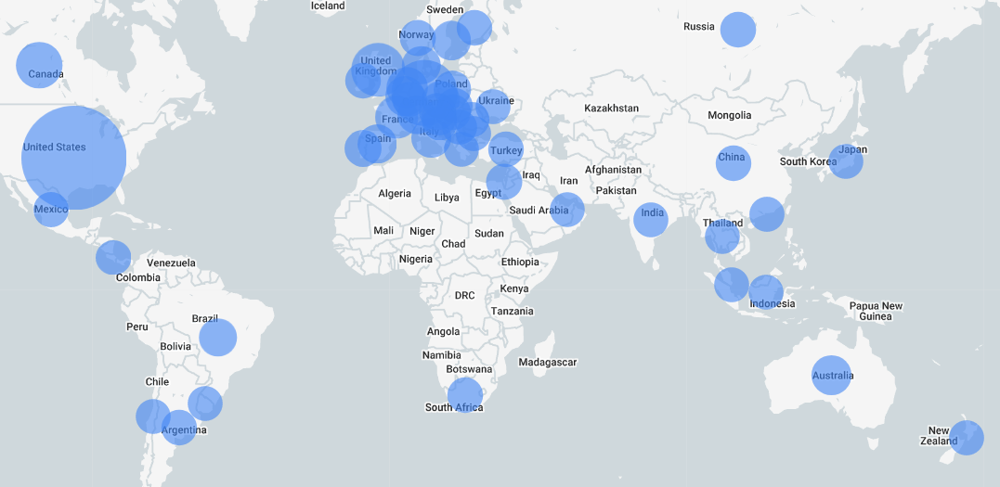
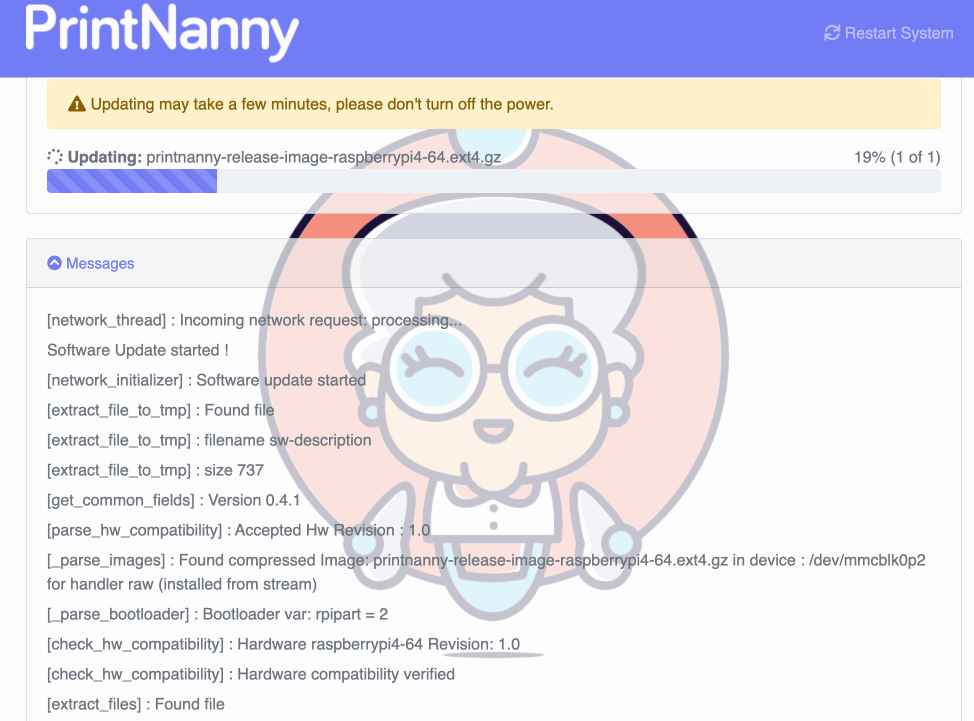

:::info
The OpenSSL team is expected to release OpenSSL version 3.0.7 on **Tuesday 1st November 2022 between 1300-1700 UTC**.

**PrintNanny OS version 0.4.1** will include the latest security fixes. If you're a Founding Member, you'll receive an email when PrintNanny OS version 0.4.1 is available.
:::

## November 1st is the Spookiest Day of the Year

If you manage servers or computer systems, few things are spookier than a critical security vulnerability disclosure to [openssl.org's mailing list](https://mta.openssl.org/pipermail/openssl-announce/2022-October/000238.html). 👻 

OpenSSL is a software library used to secure communication between computers. The OpenSSL encryption library is used on most Unix-like systems, like Linux and Apple's MacOS.

.

The OpenSSL team publishes [issue severity guidance](https://www.openssl.org/policies/general/security-policy.html), with **critical** being the highest severity level. If you were managing computer systems in 2014, you might recall another critical security disclosure: [Heartbleed](https://heartbleed.com/). 

> **CRITICAL Severity. **
>This affects common configurations and which are also likely to be exploitable. Examples include significant disclosure of the contents of server memory (potentially revealing user details), vulnerabilities which can be easily exploited remotely to compromise server private keys or where remote code execution is considered likely in common situations. These issues will be kept private and will trigger a new release of all supported versions. We will attempt to address these as soon as possible.
-- [OpenSSL Security Policy](https://www.openssl.org/policies/general/security-policy.html)

## PrintNanny will Patch Hundreds of Raspberry Pis

PrintNanny OS is a Linux distribution designed for additive manufacturing (3D printing) businesses, with optimizations for real-time computer-vision and quality monitoring tasks.

Unlike most Linux distributions, PrintNanny OS doesn't run in a datacenter. PrintNanny is deployed to **hundreds of Raspberry Pis** around the world.

When OpenSSL 3.0.7 is released, affected Pis will require a security update - but we've made the process easy! Read the next section to learn how PrintNanny OS's upgrade system works.

.

## Over-the-Air Updates

Thanks to [swupdate](https://sbabic.github.io/swupdate/swupdate.html), PrintNanny OS can easily be upgraded through a web GUI. Swupdate is an over-the-air (OTA) update system for internet-of-things (IoT) devices. 

Over-the-air software updates keep car computers, smart appliances, and other IoT devices current with the latest security fixes.

My favorite part of PrintNanny OS's updater is the **A/B** partition scheme, which means I always have a safe rollback option. 

Before I integrated swupdate, I had to run a configuration management tool (like Ansible) or re-image my Raspberry Pis to restore a previous state. The A/B partition strategy is so much more reliable!

.

### Thanks for reading!

My name is Leigh, and I'm the creator of PrintNanny.ai. If you're a Founding Member and reading this, **thank you for supporting PrintNanny's development**! 

Your trust and support means the world to me, and I'll be waking up early to ensure your devices remain secure. 🫡 

:::info
PrintNanny OS is currently in closed Beta. 

[Join the waitlist](https://printnanny.ai/) to receive stress-test invitations and launch/development updates.

[Reserve your spot in the Founding Member program](https://printnanny.ai/shop/founding-membership), which grants you **immediate early access to PrintNanny for $149 USD.** A limited number of spots open after each release, available on a first-come, first-serve basis. 

Founding Members get access to a private Discord channel and unlimited use of PrintNanny services.
:::