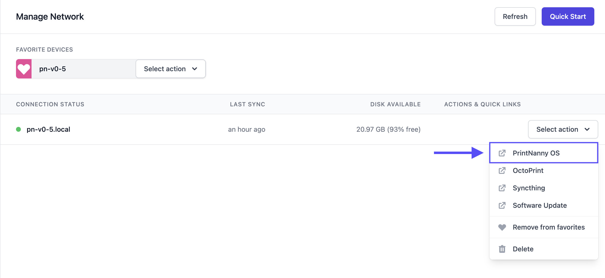

# Mainsail + Moonraker + Klipper

This section will show you how to set up Mainsail (Web UI), Moonraker (API), and Klipper (firmware).

:::info
If your 3D printer ships with Marlin firmware, achieving reliably great results with Klipper will require tinkering/tuning.

:::

## Prerequisites

Make sure you've have the following before proceeding to the next section:

* [SD card with latest version of PrintNanny OS.](/docs/quick-start/create-printnanny-os-image/)
* [Raspberry Pi connected to PrintNanny Cloud](https://printnanny.ai/docs/quick-start/connect-printnanny-cloud/)

## Configure Klipper `printer.cfg`

1. [Log into PrintNanny Cloud](https://printnanny.ai/devices/)
2. Click the **PrintNanny OS** link in the Actions & Quick Links menu. This will open PrintNanny OS's **Mission Control** dashboard.



3. Click the gear icon ⚙️ to open PrintNanny OS settings.


4. Click `Edit Settings Files` in the left-hand menu, and select `klipper/printer.cfg` from the file drop-down.

5. Copy/paste the following into the code editor:

```
###
# This file contains Klipper configuration.
# See https://www.klipper3d.org/Example_Configs.html for reference.
###

### 
# Mainsail macros - DO NOT DELETE!
### 
[pause_resume]

[display_status]

[virtual_sdcard]
path: ~/media/gcode
on_error_gcode:
  CANCEL_PRINT

[gcode_macro CANCEL_PRINT]
description: Cancel the actual running print
rename_existing: CANCEL_PRINT_BASE
variable_park: True
gcode:
  ## Move head and retract only if not already in the pause state and park set to true
  
    _TOOLHEAD_PARK_PAUSE_CANCEL
  
  TURN_OFF_HEATERS
  M106 S0
  CANCEL_PRINT_BASE

[gcode_macro PAUSE]
description: Pause the actual running print
rename_existing: PAUSE_BASE
gcode:
  PAUSE_BASE
  _TOOLHEAD_PARK_PAUSE_CANCEL

[gcode_macro RESUME]
description: Resume the actual running print
rename_existing: RESUME_BASE
gcode:
  ##### read extrude from  _TOOLHEAD_PARK_PAUSE_CANCEL  macro #####
  
  #### get VELOCITY parameter if specified ####
  
    
  
    
  
  ##### end of definitions #####
  
    M83
    G1 E{extrude} F2100
     M82 
  
    {action_respond_info("Extruder not hot enough")}
  
  RESUME_BASE {get_params}

[gcode_macro _TOOLHEAD_PARK_PAUSE_CANCEL]
description: Helper: park toolhead used in PAUSE and CANCEL_PRINT
variable_extrude: 1.0
gcode:
  ##### set park positon for x and y #####
  # default is your max posion from your printer.cfg
  
  
  
  ##### calculate save lift position #####
  
  
  
    
  
    
  
  ##### end of definitions #####
  
    M83
    G1 E-{extrude} F2100
     M82 
  
    {action_respond_info("Extruder not hot enough")}
  
  
    G91
    G1 Z{z_safe} F900
    G90
    G1 X{x_park} Y{y_park} F6000
     G91 
  
    {action_respond_info("Printer not homed")}
  


### 
# Paste your printer configuration below this section
###


```

6. In a new tab, [open Klipper's example configuration files] and **copy** the `.cfg` for your 3D printer: (https://github.com/Klipper3d/klipper/tree/master/config)


:::info

If you're not sure which Klipper configuration to use, refer to [Klipper's configuration docs](https://www.klipper3d.org/Example_Configs.html) for more information.

:::

7. **Paste** the contents underneath the section that says `Paste your printer configuration below this section`

8. Click the **Save** button to save your changes.

## Enable Mainsail

1. Click `Home` to return to Mission Control
2. Use the toggle-switch to enable the Mainsail add-on.

:::info

The first time you enable Mainsail, you'll need to wait a few extra minutes.

When you see the notification `Mainsail is now available` you can proceed to the next step. 

:::

3. Click the `Open Mainsail` button to open the Mainsail dashboard in a new tab.

4. Refer to [Mainsail settings](https://docs.mainsail.xyz/overview/settings) to continue customizing your Mainsail dashboard.


## Resources

* [Example Klipper configurations](https://www.klipper3d.org/Example_Configs.html)
* [Reddit /r/klippers](https://www.reddit.com/r/klippers/)
  