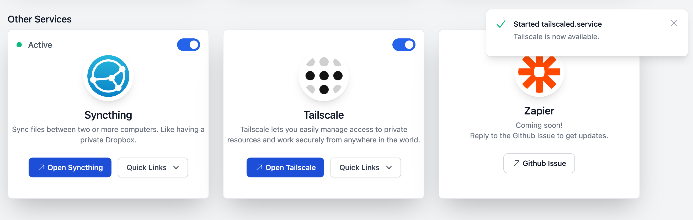

# Tailscale VPN

## What is Tailscale?

Tailscale provides a Virtual Private Network (VPN).

Tailscale lets you easily manage access to private resources, quickly SSH into devices on your network, and work securely from anywhere in the world.

## Start Using Tailscale

To get started, install Tailscale on a personal computer or mobile device.

Follow the directions in [Tailscale Quick Start](Tailscale quickstart
) to:

1. Sign up for a Tailscale account. 
2. [Download Tailscale](https://tailscale.com/download/) on a personal computer or mobile device.
3. Connect your personal computer or mobile phone to your Tailscale network.

## Connect PrintNanny to Tailscale Network

1. [Log into PrintNanny Cloud](https://printnanny.ai/devices/)
2. Click the **PrintNanny OS** link in the Actions & Quick Links menu. This will open PrintNanny OS's **Mission Control** dashboard.

3. Scroll to the **Other Services** section and **Enable Tailscale** by clicking the switch-toggle. When the Tailscale service is ready, you'll see a notification: **Tailscale is now available**

4. Open the **Quick Links** menu and click **Add Device to Network**

5. Click the **Login** button to log into your Tailscale account and finish setup.

