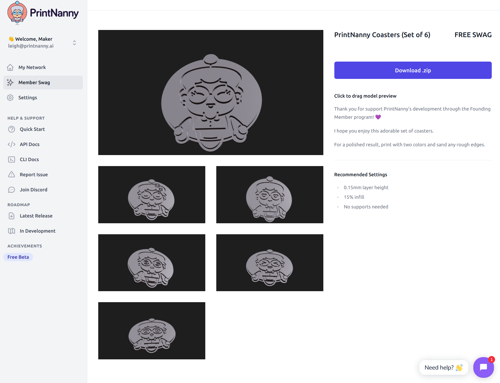

# Founding Member FAQ

:::info

PrintNanny is currently in **closed beta**. 

The Founding Member program is the only way to get early access to PrintNanny, for an annual membership fee of $149 USD.

A **limited number** (typically 10-20) of Founding Member spots open after each new release.

Reserve your spot by emailing leigh@printnanny.ai. 
:::

## When will PrintNanny's beta end?

The beta program will run through Q1 2023.

Founding Members retain full unlimited access to PrintNanny, and will never see a price hike - even if we decide to raise prices after launch. 

You are guaranteed the $149/year unlimited rate for life, as our way of saying thank you.

## What's included in a Founding Membership?

For $149, you get unlimited access to PrintNanny OS and PrintNanny Cloud. You will be able to:

* Stream unlimited video data. No bandwidth fees or caps.
* Connect an unlimited number of printers for one flat rate.
* Access a private #members-only Discord channel (for life). 
* [Drive PrintNanny's roadmap](https://github.com/bitsy-ai/printnanny-os/milestones) - Founding Members help us decide what to build.
* Get exclusive 3D-printable swag (set of two-tone coasters, Raspberry Pi 4 case)

.

## How much does a Founding Membership cost?

For $149 USD / year, you get unlimited access to PrintNanny OS and PrintNanny Cloud. You are guaranteed the $149/year unlimited rate for life, no matter how many printers you add - as our way of saying thank you.

## What is your refund policy?

If you're not satisfied with PrintNanny or realize the Founding Member program isn't a good fit for you - we'll provide a full **full refund**. Send an email to leigh@printnanny.ai to start the refund process.

## Why are so few memberships available?

Not everyone is the kind of person willing to roll up their sleeves and get their hands dirty. **Founding Members are special** in that regard - they acid test PrintNanny's early features, provide thoughtful feedback, and are often entrepeners themselves. 

As our way of saying thank you, we're giving Founding Members unlimited access to PrintNanny for a flat rate. This allows us to support the "Founding Team" behind PrintNanny in perpetuity. We're rooting for Founding Members to scale up their own businsses, which is why we're guaranteeing unlimited usage for one low price.

If you'd prefer to wait until PrintNanny's public launch, we totally understand! Stay tuned for details in Q1 2023.

## How many Founding Memberships are available?

Around 100 Founding Memberships will unlock over the course of the beta period, with 10-20 spots opening per release.

You can reserve your spot by emailing by emailing leigh@printnanny.ai. We use Stripe checkout to process payments.

## Is there a monthly subscription tier?

No, Founding Memberships are only available at the annual rate.

A monthly plan will be available when PrintNanny launches to the public in 2023.

## Is there a free trial?

No, you can only access PrintNanny after your membership is processed.

However, if you're not satisfied with PrintNanny or realize the Founding Member program isn't a good fit for you - we offer a **full refund policy**. Send an email to leigh@printnanny.ai to start the refund process.

## Was there a free beta?

PrintNanny's free beta ran January 2021 - June 2021. If you participated in the free beta program, thank you! You should have received an invitation to upgrade to a Founding Membership at a special discounted rate ($99/year).

If you participated in the free beta and missed this coupon, email leigh@printnanny.ai to honor the discounted rate.

## What hardware do I need?

You'll need to gather everything listed in the [Required Hardware](https://docs.printnanny.ai/docs/quick-start/hardware/) section.

:::caution
Please read the hardware requirements carefully! You will need a Raspberry Pi 4, a power supply, camera, heatsinks, and Micro SD card rated for 10 MB/s data transfer.

[Join Discord](https://discord.gg/sf23bk2hPr) if you have any questions about PrintNanny's hardware requirements.
:::

## Do I really need a Raspberry Pi 4? Will a Raspberry Pi 3B work?

PrintNanny requires a Raspberry Pi 4 with at least 2GB of RAM (4GB is recommended for best performance).

We know Raspberry Pi 4 is difficult to find at a reasonable price right now, due to supply-chain issues. We're working on a hardware kit, which will include a Raspberry Pi 4.

## Do you sell hardware kits?

Not yet, but we'll be offering a Raspberry Pi 4 kit that ships to the US/Canada soon. Stay tuned!

## I have a question not listed here!

Ask away! You can email your question to leigh@printnanny.ai directly, or [Join Discord](https://discord.gg/sf23bk2hPr) to see what others are saying about PrintNanny.