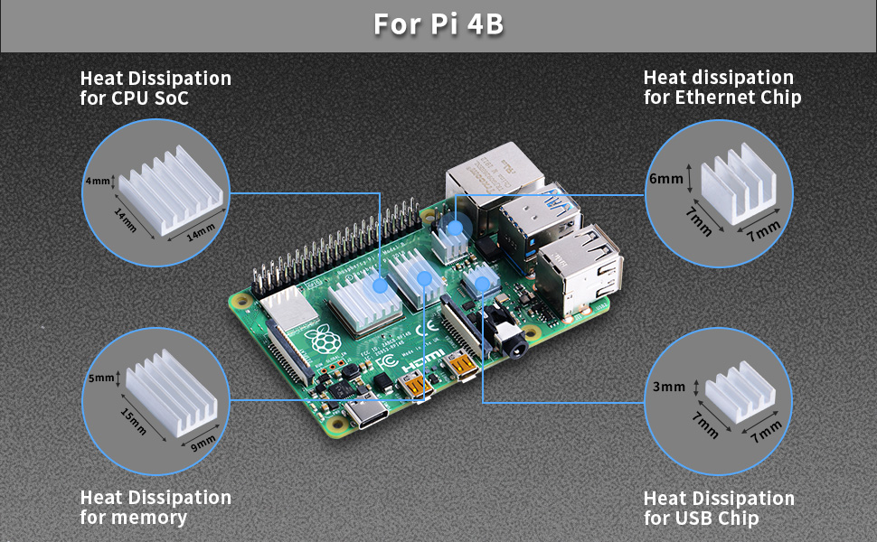
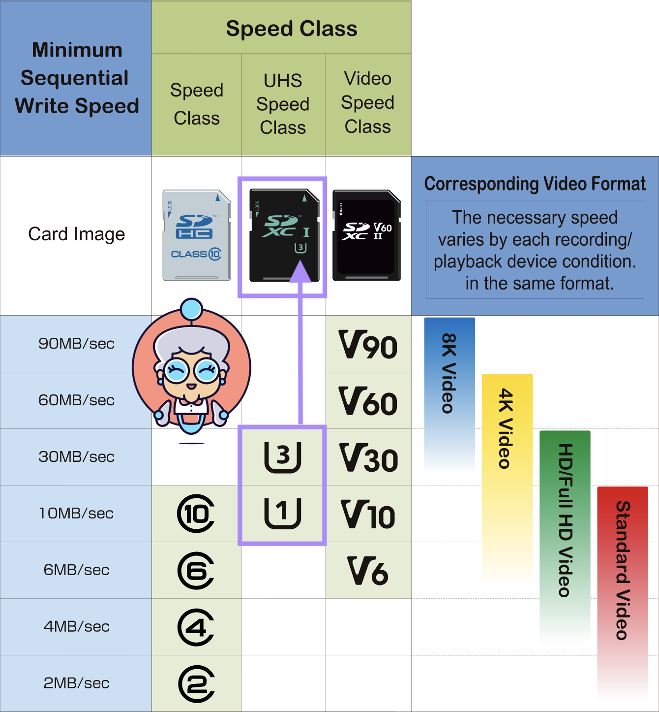
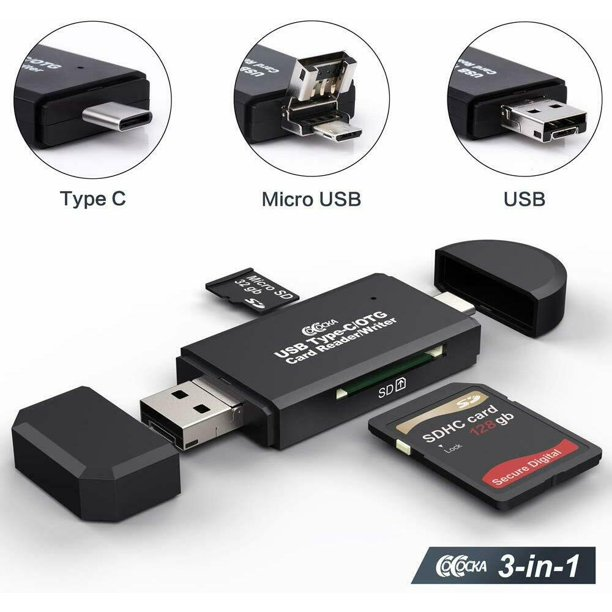

# Required Hardware

Before you get started, make sure you have all required hardware.

## 1. Raspberry Pi 4, Model B 

* Minimum: 2GB RAM
* Recommended: 4GB RAM

[Search raspberrypi.com](https://www.raspberrypi.com/products/raspberry-pi-4-model-b/) to find an approved Raspberry Pi reseller.

:::info

Subscribe to the following Github issues to track support for other boards.
* [Raspberry Pi 3](https://github.com/bitsy-ai/printnanny-os/issues/16) 
* [Rock Pi 4](https://github.com/bitsy-ai/printnanny-os/issues/37)
:::

## 2. Power Suppy

* 5.1V / 3.0A DC output
* 96-264Vac operating input range

The official [Raspberry Pi 15W USB-C Power Supply](https://www.raspberrypi.com/products/type-c-power-supply/) is recommended. 

Inadquate power will impact the quality of your prints and limit PrintNanny's ability to catch defects. 

## 3. Camera

PrintNanny is known to work with the following cameras:

* [Raspberry Pi Camera Module 2](https://www.raspberrypi.com/products/camera-module-v2/) (IMX219)
* [Raspberry Pi High Quality Camera](https://www.raspberrypi.com/products/raspberry-pi-high-quality-camera/) (IMX477)

:::info

Do you have a camera not listed above? No problem! 

Email support@printnanny.ai or 
[reply to this Github issue to request support](https://github.com/bitsy-ai/printnanny-os/issues/38). 
:::

## 4. Heatsinks

* Minimum: CPU heatsink
* Recommended: heatsinks CPU, USB, ethernet, and RAM chip

For help installing the heatsinks, check out [How to Install Heatsinks on the Raspberry Pi 4.](https://www.youtube.com/watch?v=E-4GaAz7XNM)

.

## 5. Micro SD card

* Minimum: 10MB/s write speed

You'll need an SD card with **UHS speed class 1** or **UHS speed class 3.**

## 6. USB to SD card adaptor (optional)

If your computer doesn't have SD card slot, you'll need a USB to SD card adaptor.

