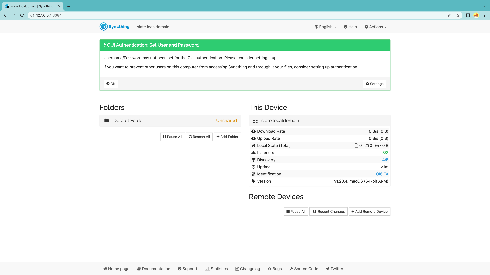
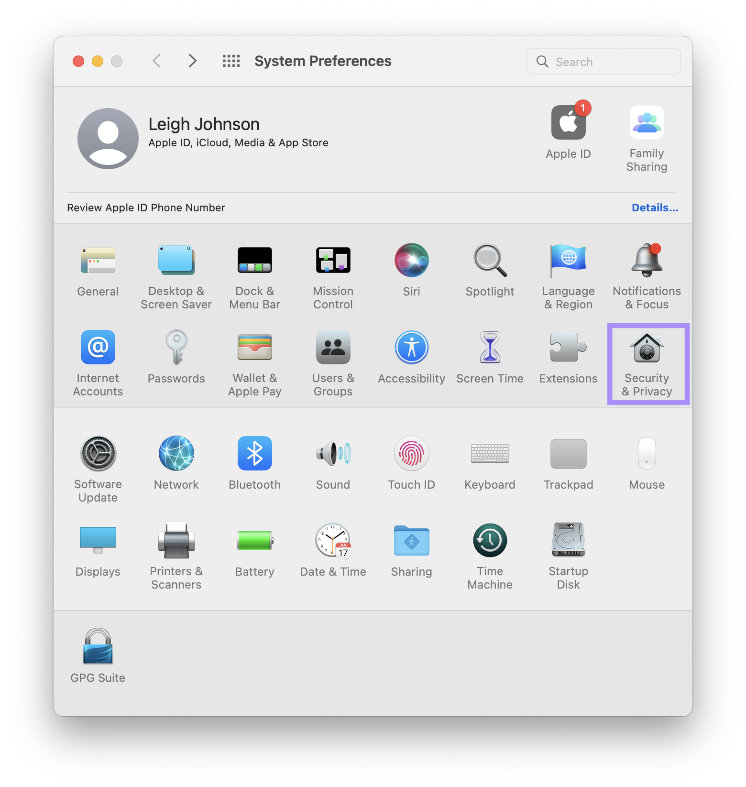
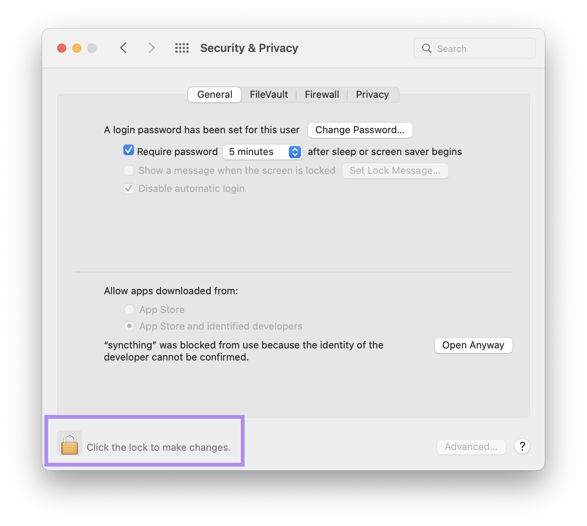
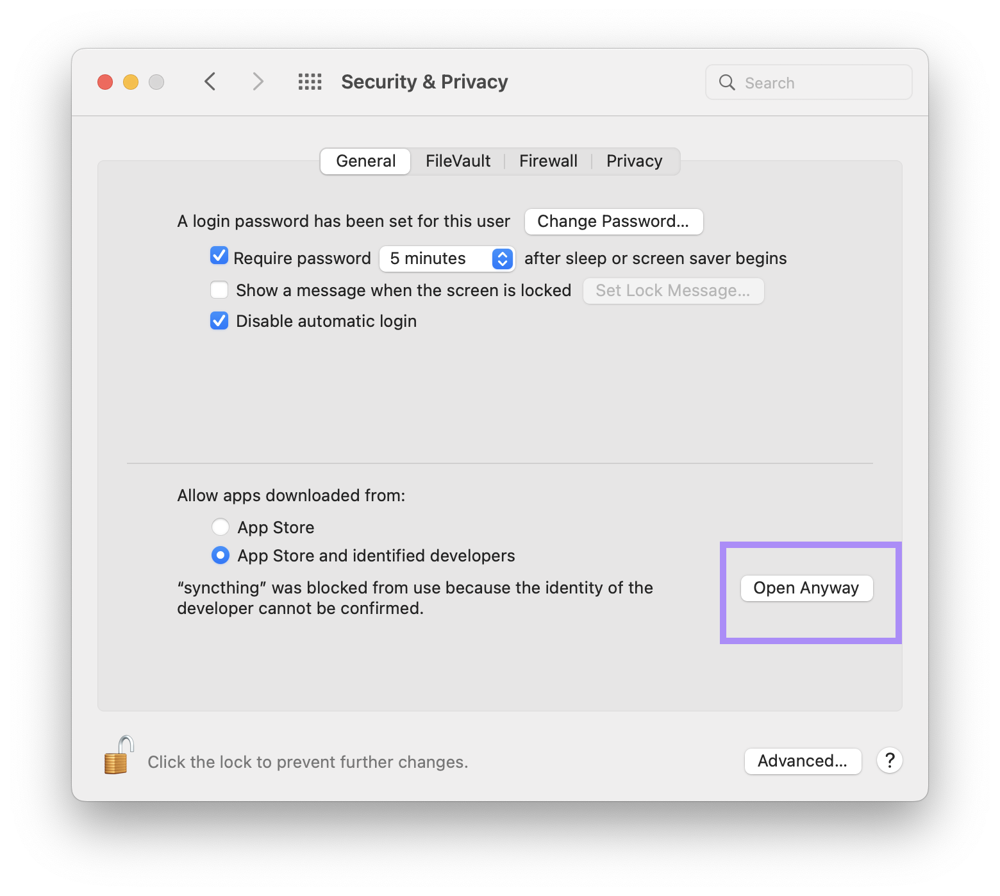
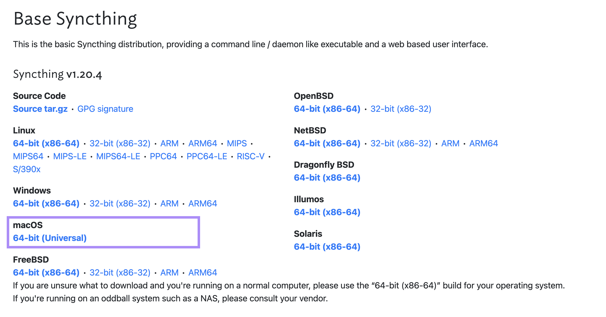
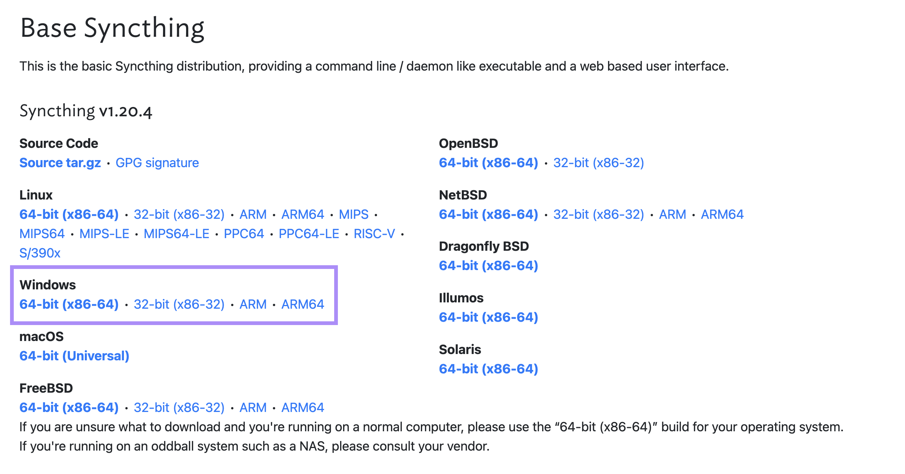
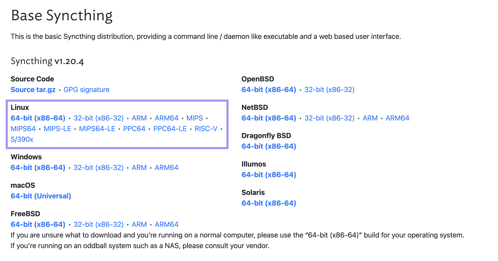
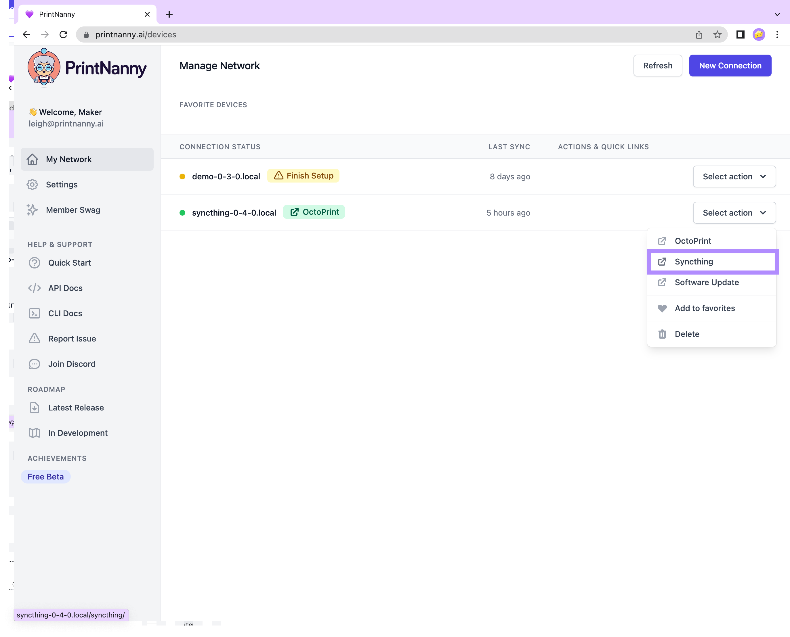

# Configure File Sync (Syncthing)

This section will show you how to set up [Syncthing](https://syncthing.net/), which is keeps your files synchronized between multiple computers.

:::info

Syncthing is like having your own private Dropbox or Google Drive.

We love Syncthing because your data remains private. **None of your data is ever stored anywhere else other than on your computers.** There is no central server that might be compromised, legally or illegally.

All communication between Syncthings is **encrypted** with TLS.

:::

## Install Syncthing on a Personal Computer

First, you will need to install Syncthing on your laptop, desktop, or other personal computer. You only need to do this once!

After Syncthing is installed, you should be able to open the Syncthing web ui. The default url is: `127.0.0.0:8384`

.

### Install Syncthing Base (MacOS)

1. Download the universal MacOS Installer.
2. Unzip the `syncthing-macos-universal` folder.
3. Double-click the `syncthing` binary file to run syncthing in your terminal.
4. Syncthing will open `127.0.0.0:8384` in your browser

If you see a pop-up warning that says **“syncthing” can’t be opened because the identity of the developer cannot be confirmed.**, follow these steps to run syncthing.

1. Open MacOS **Security & Privacy** in the Settings menu

.

2. Click the **lock icon** in the lower left-hand corner to edit your security settings.

.

3. Click the **Open Anyway** button to allow syncthing application.

.

.

1. Download the universal MacOS Installer
2. Unzip the `syncthing-macos-universal` folder
3. Double-click the `syncthing` binary file.

### Install Syncthing Base (Windows)

1. Download the Windows installer for your CPU architecture
2. Unzip the syncthing folder.
3. Double-click the `syncthing` binary file to run syncthing in your terminal.
4. Syncthing will open `127.0.0.0:8384` in your browser

.

### Install Syncthing Base (Linux)

1. Download the Linux installer for your CPU architecture
2. Unzip the syncthing folder.
3. Double-click the `syncthing` binary file to run syncthing in your terminal.
4. Syncthing will open `127.0.0.0:8384` in your browser

.

### Open PrintNanny OS Syncthing

1. Open the [PrintNanny Cloud device dashboard](https://printnanny.ai/devices)
2. Click the *Select Action* menu and open the *Syncthing* link

.

### Connecting Syncthing devices

Follow the [Syncthing Getting Started Guide](https://docs.syncthing.net/intro/getting-started.html#configuring) to connect Syncthing on your personal computer with Syncthing on a Raspberry Pi. 
