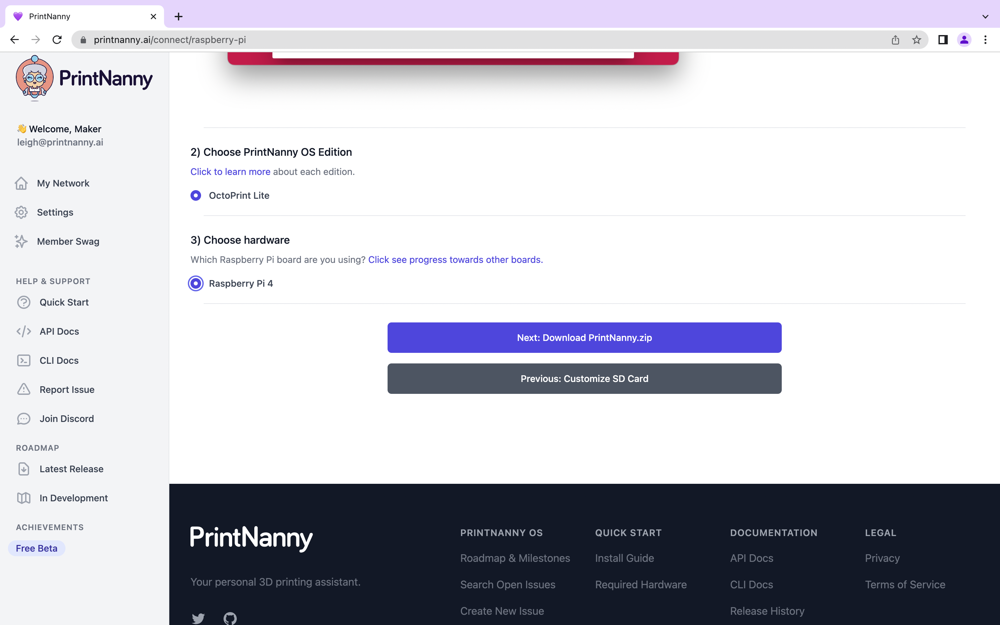
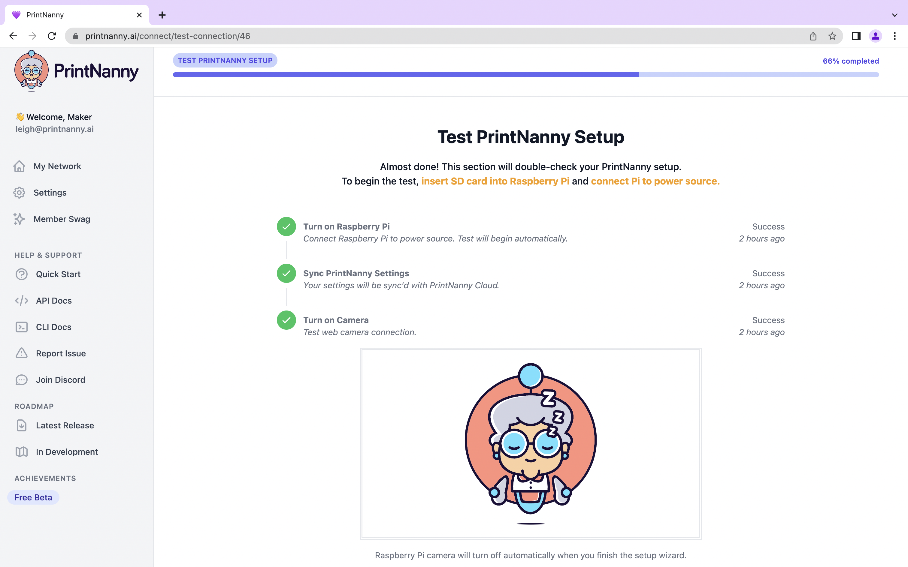
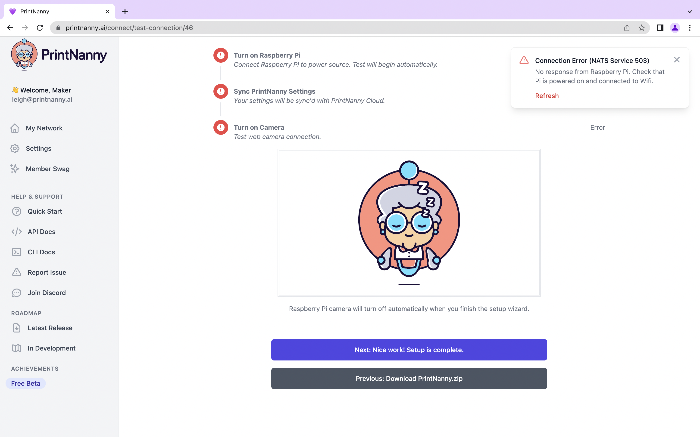

# Configure PrintNanny OS

This section will show you how to download `printnanny.toml`, which contains your PrintNanny account info and preferences.

:::warning

Do not share the contents of `printnanny.toml`! 

This file contains sensitive license info, which is used to register and authenticate your device. 
:::

### 1. Open [PrintNanny Cloud dashboard](https://printnanny.ai/devices) in your browser

### 2. Click ["+ New Connection"](https://printnanny.ai/connect/customize-sd-card) button

.

### 3. In the `hostname` field, enter the **same hostname** you set using Raspberry Pi Imager. 
### **Click the save button**

.

### 4. Select PrintNanny OS Edition and Raspberry Pi model

.

### 4. Download `printnanny.zip` and copy to the `boot` partition of your SD card.

### 5. Eject your SD card.

### 6.Connect Raspberry Pi to a monitor/screen (optional)

Skip this step if you plan to use PrintNanny without a monitor. If you connect a monitor, PrintNanny will show you boot/setup progress.

### 7. Insert SD card into Raspberry Pi's card slot and connect your Raspberry Pi to power.

### 8. Test Raspberry Pi Connections

When your Raspberry Pi boots for the first time, a connection test will begin automatically. If everything looks good, click the "next" button to exit the setup wizard.

If you see errors during the connection test, try restarting your Raspberry Pi. If the errors persist, reach out to leigh@printnanny.ai for assistance. 

