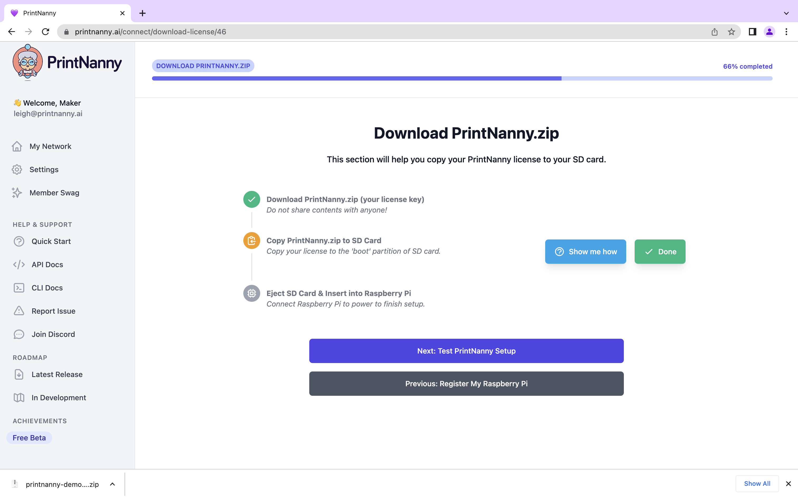

# Configure PrintNanny OS

This section will show you how to download `printnanny.toml`, which contains your PrintNanny account info and preferences.

:::warning

Do not share the contents of `printnanny.toml`! 

This file contains sensitive license info, which is used to register and authenticate your device. 
:::

### 1. Open [PrintNanny Cloud dashboard](https://printnanny.ai/devices) in your browser

### 2. Click ["+ New Connection"](https://printnanny.ai/devices/connect) button

.

### 3. In the `hostname` field, enter the **same hostname** you set using Raspberry Pi Imager. 
### **Click the save button**

.

### 4. Download `printnanny.toml` and copy to the `boot` partition of your SD card.

### 5. Eject your SD card.

### 6. Insert SD card into Raspberry Pi's card slot and connect your Raspberry Pi to power.

### 7. Wait for first boot to finish.

You'll get an email when your PrintNanny device is ready to use! This step usually takes around 5 minutes.

