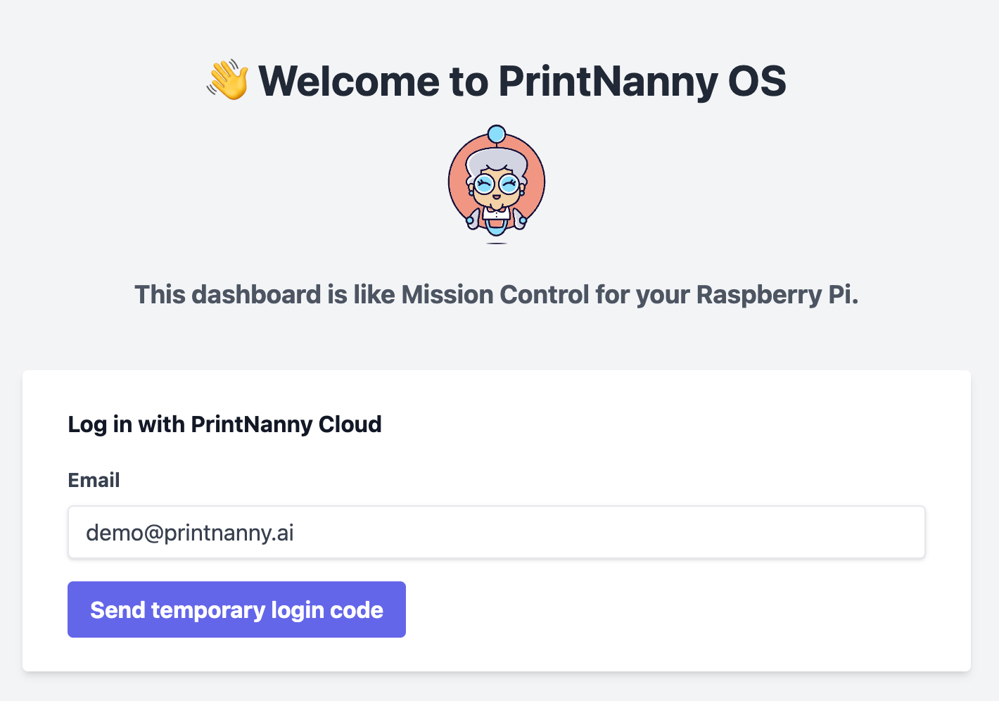
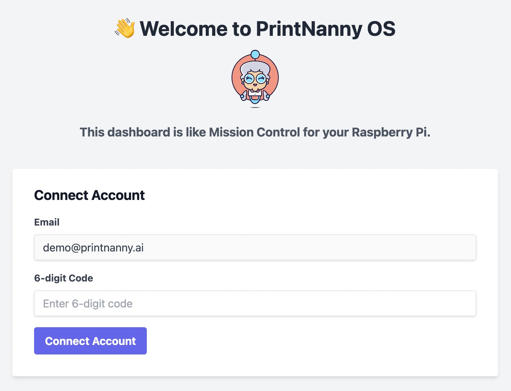
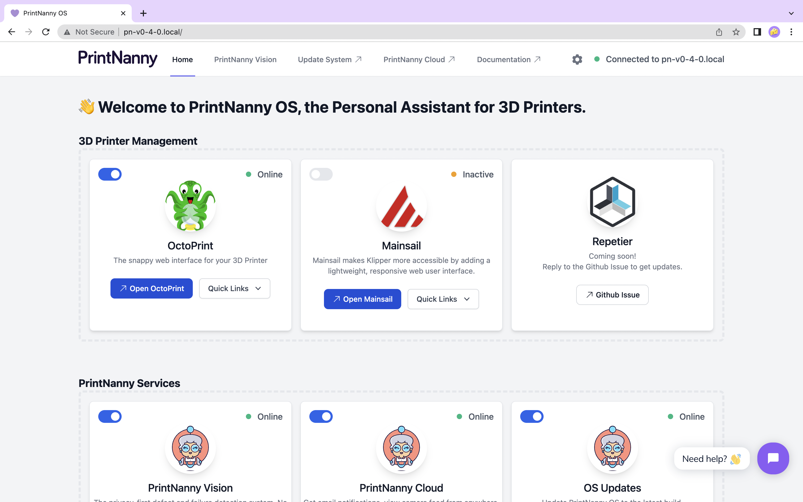

# Connect PrintNanny Cloud

This section will show you how to open *PrintNanny OS's dashboard*, then link your **PrintNanny Cloud** account.

### 1. Open PrintNanny OS dashboard in your browser

The url will be `http://<hostname>.local`

So if you named your Raspberry Pi `printnanny`, you would go to: [http://printnanny.local/](http://printnanny.local/)

### 2. Enter your email address

You'll be prompted to enter your email address, so you can receive a temporary login code.

.

### 3. Enter the temporary login code

Enter the temporary login code that was sent to your email address.

.

### 4. 👋 Welcome to PrintNanny OS

After you connect your account, you'll be redirected to PrintNanny OS's mission control dashboard.

.
