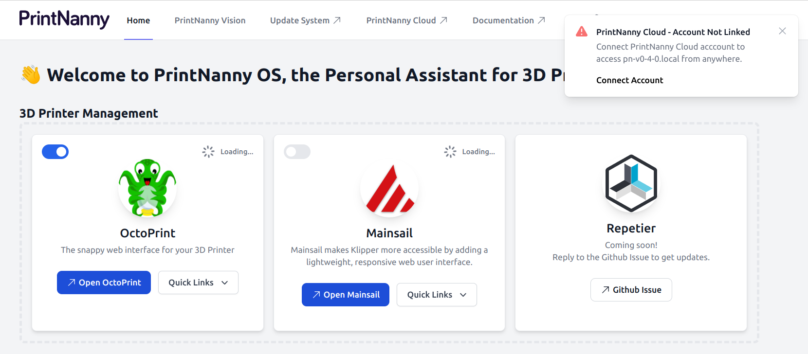
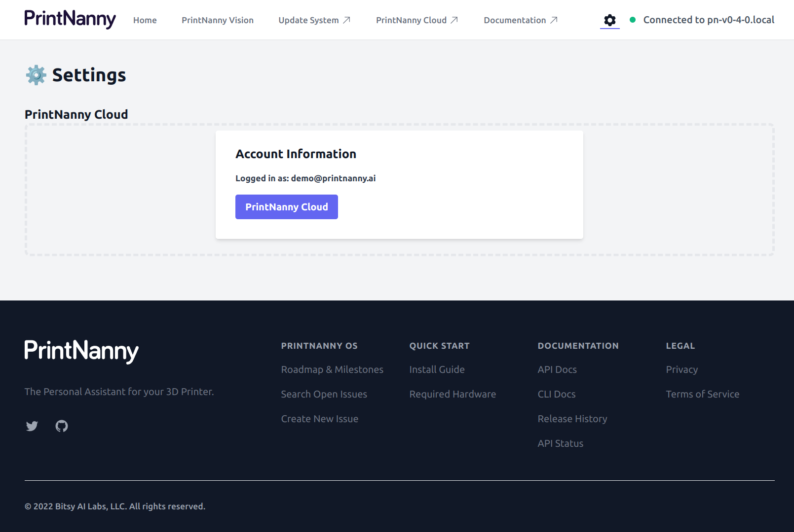

# Connect PrintNanny Cloud

This section will show you how to open *PrintNanny OS's dashboard*, then link your **PrintNanny Cloud** account.

### 1. Open PrintNanny OS dashboard in your browser

The url will be `http://<hostname>.local`

So if you named your Raspberry Pi `printnanny`, you would go to: [http://printnanny.local](http://printnanny.local)

### 2. Click the **Connect Account** link in the alert message

You should see a message: "PrintNanny Cloud - Account Not Linked"

Click the **Connect Account** link the alert message.

.

### 3. Enter your email address

Enter the same email address you used to register for PrintNanny Cloud.

.

### 4. Enter verification code

Enter the verification code sent to your email address.

.

After you enter the correct code, PrintNanny OS will be linked to your PrintNanny Cloud account.

.

