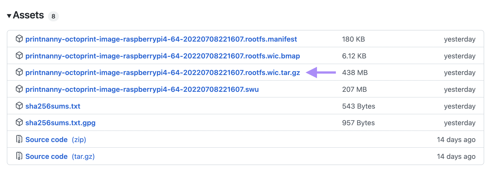
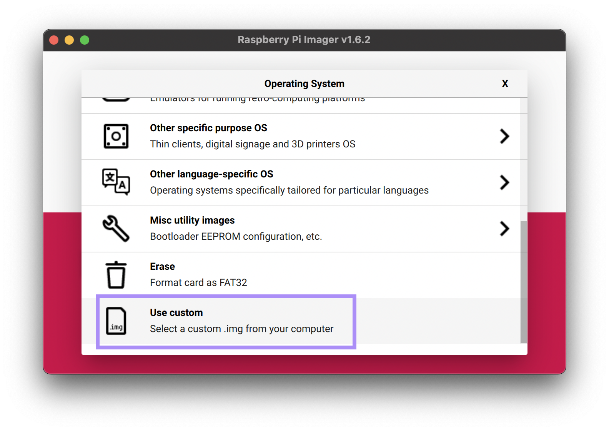
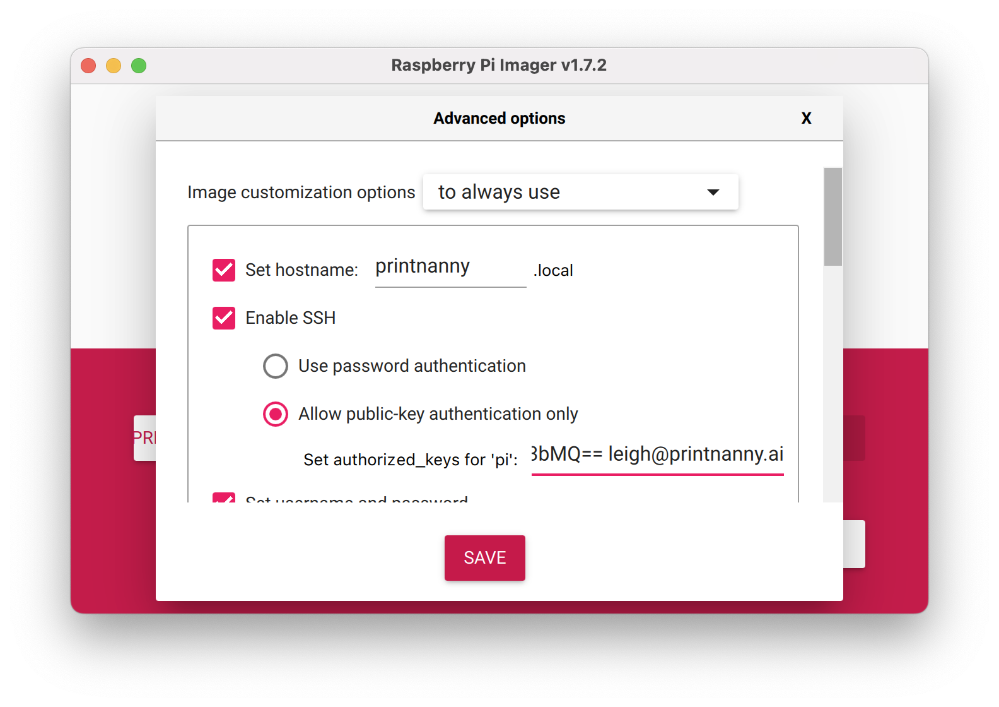
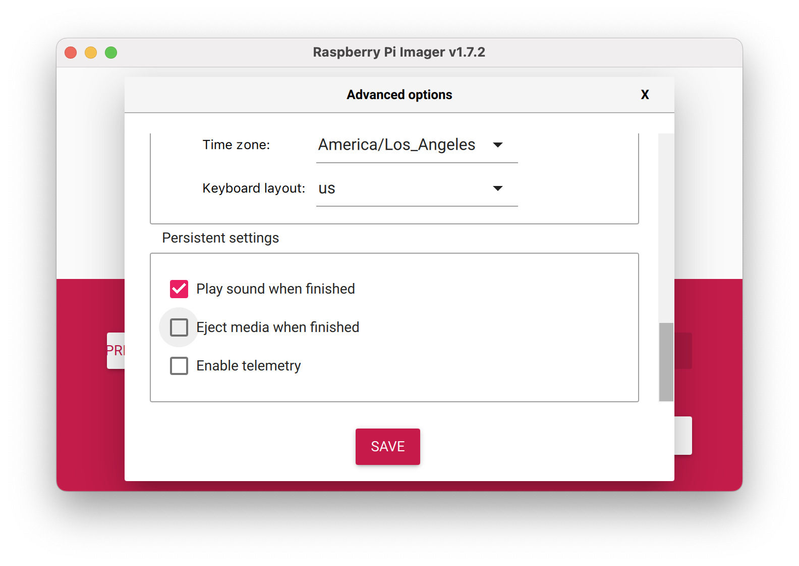

# PrintNanny OS Image

This section will walk you through writing a PrintNanny OS image to your SD card.

## 1. Install Raspberry Pi Imager

Download and install [Raspberry Pi Imager](https://www.raspberrypi.com/software/).

## 2. Download PrintNanny OS image 

Browse to the [PrintNanny OS releases page](https://github.com/bitsy-ai/printnanny-os/releases) and download the latest `.wic.tar.gz` file.

.

## 3. Configure & Burn Image

1. Open Raspberry Pi Imager. Click the **Choose OS** button, then select **Use custom** at the **bottom** of the menu.

.

2. Click the **Choose Storage** button and select your MicroSD Card from the menu.
3. Click the **⚙️ Gear Icon** or press ctrl + shift + x to open **Advanced.
4. **Set the hostname** of your Raspberry Pi (must be unique on your network.

.

5. Check the __Enable SSH__ box and **set a password for your Pi**.

    If you prefer to use SSH authentication, provide your public key instead
6. Configure your **wireless LAN** SSID and passphrase.
7. Set your **locale** and **keyboard layout**.
8. **Un-check** the __Eject media when finished__ option.

.

9. Click **Save** to save your settings and then **Write** to burn the image to your SD card.

## 4. Don't eject your SD card yet!

Continue to the next section to configure PrintNanny **before** you eject your SD card.

