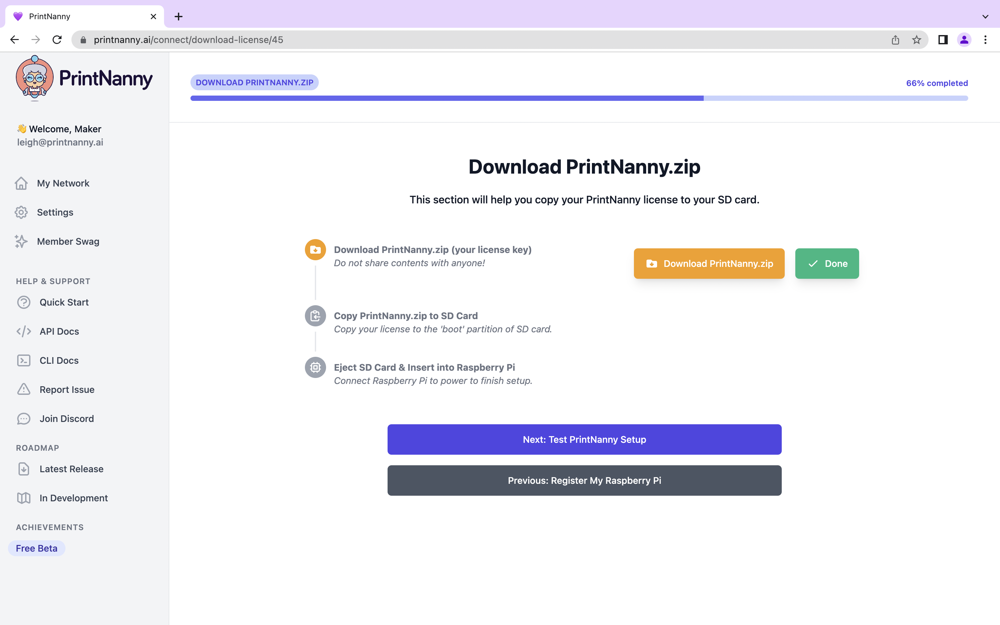

# v0.3.0 (Cinnabar Kirkstone)

Cinnabar delivers exciting updates to PrintNanny's camera streaming service!

You can now view your **PrintNanny camera** from a **mobile/cellular network.**

When you're viewing PrintNanny at home, you'll still **connect directly to your Raspberry Pi** to conserve bandwidth.

## ⬇️ [Click to Download PrintNanny OS](https://github.com/bitsy-ai/printnanny-os/releases/tag/0.3.0)

* Follow the [Quick Start guide](https://docs.printnanny.ai/docs/category/quick-start/) to create a fresh PrintNanny OS installation.
* [Update a Raspberry Pi already running PrintNanny OS](https://docs.printnanny.ai/docs/update-printnanny-os/).

:::info

PrintNanny OS is in early access. [Join the waitlist](https://printnanny.ai/) to receive stress-test invitations and development updates.

Email leigh@printnanny.ai to join the **Founding Member** program, which grants you **immediate access to PrintNanny for $150 (USD)**. You'll also get exclusive swag and access to a private #founding-members channel, which drives PrintNanny's roadmap.
:::


## ✨ What's New in v0.3.0?

[See all GitHub issues closed in v0.3.0](https://github.com/bitsy-ai/printnanny-os/issues?q=is%3Aclosed+milestone%3A0.3.0)

### Fresh New Look

* **PrintNanny's Cloud UI received a facelift!** Let me know what you think of the new look/feel.
* **New setup wizard for PrintNanny OS.** This guided walkthrough will help you download, configure, and test PrintNanny OS. 

.

### Cloud-based WebRTC Gateway

* **You can now view your Raspberry Pi camera from mobile/cellular connection**

:::info

Check out [What's Inside PrintNanny?](/docs/whats) to learn more about PrintNanny's architecture and components.
:::

### NATS replaces Cloud IoT Core

Earlier this month, [Google Cloud Platform's IoT Core](https://cloud.google.com/iot/docs/release-notes) service was **discontinued by Google.**

PrintNanny had used IoT Core's managed MQTT broker and identify (certificate) management system **since launch**.

When Google made the announcement 12 days ago, I migrated PrintNanny's event system to use a [NATS](https://nats.io/) message broker and [NATS Nkeys](https://docs.nats.io/running-a-nats-service/configuration/securing_nats/auth_intro/nkey_auth) for authentication/identity management. You'll notice `printnanny-mqtt.service` has been removed and replaced by `printnanny-nats.service`.

Don't worry! [NATs is able to broker MQTT protocol](https://docs.nats.io/running-a-nats-service/configuration/mqtt), which is a staple in the internet-of-things universe. 

PrintNanny will continue to support **both MQTT and websocket-based events**. 🙌

### PrintNanny API Docs

You can now find interactive docs for PrintNanny's API at the following urls:

* [https://printnanny.ai/api/schema/redoc/](https://printnanny.ai/api/schema/redoc/) (Redoc)
* [https://printnanny.ai/api/schema/swagger-ui/](https://printnanny.ai/api/schema/swagger-ui/) (Swagger)

PrintNanny's API is defined by an [OpenAPI schema](https://openapi-generator.tech/), which is used to generate API client code in Rust, Typescript, and Python. 

### Issue.txt in Message of the Day

The contents of `/etc/issue` are now shown via Linux's [message of the day](https://en.wikipedia.org/wiki/Message_of_the_day) system.

```
$ssh root@demo-0-3-0.local
Last login: Sun Aug 28 13:18:10 2022


_____      _       _   _   _
|  __ \    (_)     | | | \ | |
| |__) | __ _ _ __ | |_|  \| | __ _ _ __  _ __  _   _
|  ___/ '__| | '_ \| __| . ` |/ _` | '_ \| '_ \| | | |
| |   | |  | | | | | |_| |\  | (_| | | | | | | | |_| |
|_|   |_|  |_|_| |_|\__|_| \_|\__,_|_| |_|_| |_|\__, |
                                                 __/ |
                                                |___/
-----------------------
Build Info:  |
-----------------------
BUILD_ID = 2022-08-27T21:28:11Z
DISTRO_PRETTY = PrintNanny Linux 0.3.0 (Cinnabar)
DISTRO = printnanny
DISTRO_NAME = PrintNanny Linux
DISTRO_VERSION = 0.3.0
DISTRO_CODENAME = Cinnabar
ID_LIKE = BitsyLinux
HOME_URL = https://printnanny.ai
BUG_REPORT_URL = https://github.com/bitsy-ai/printnanny-os/issues
YOCTO_VERSION = 4.0.2
YOCTO_CODENAME = Kirkstone
MACHINE = raspberrypi4-64
TUNE_PKGARCH = cortexa72
-----------------------
Layer Revisions:      |
-----------------------
meta              = kirkstone:387ab5f18b17c3af3e9e30dc58584641a70f359f
meta-poky         = kirkstone:387ab5f18b17c3af3e9e30dc58584641a70f359f
meta-yocto-bsp    = kirkstone:387ab5f18b17c3af3e9e30dc58584641a70f359f
meta-raspberrypi  = master:62a84833d90dfc18f8057bc5e99e96eff6798f12
meta-oe           = master:a9e6d16e6640d105ecf3470ab891598034c9ef33
meta-python       = master:a9e6d16e6640d105ecf3470ab891598034c9ef33
meta-multimedia   = master:a9e6d16e6640d105ecf3470ab891598034c9ef33
meta-bitsy        = main:59f1b222578cbdd0bf3c18cb67f52643b0eb7c89
meta-neural-network = master:1d70eb6c0f6d5a7d5dc904ae988a7e152b52267e
meta-printnanny   = main:59f1b222578cbdd0bf3c18cb67f52643b0eb7c89
meta-networking   = master:a9e6d16e6640d105ecf3470ab891598034c9ef33
meta-filesystems  = master:a9e6d16e6640d105ecf3470ab891598034c9ef33
meta-initramfs    = master:a9e6d16e6640d105ecf3470ab891598034c9ef33
meta-webserver    = master:a9e6d16e6640d105ecf3470ab891598034c9ef33
meta-swupdate     = master:554b97ac9970ccdb41408f2440cd48446534a7d7
workspace         = kirkstone:387ab5f18b17c3af3e9e30dc58584641a70f359f
```

### Package Upgrades

* OctoPrint upgraded to 1.8.2 (patch XSS vulnerability)
* OctoPrint-Nanny plugin upgraded to 0.13.3
* Cloud-init upgraded to 22.3. Required to begin rolling out PrintNanny Network (zero setup Wireguard VPN). 

Email leigh@printnanny.ai if you're interested in early access to PrintNanny Network.

## 📣 News & FYI

### PrintNanny Attended Summer School

PrintNanny participated in [Ycombinator's Startup School Summer 2022](https://www.startupschool.org/) program, which ran from June 27 - August 10.

### Open Source Contributions

PrintNanny is built on open-source software and contributes time, money, code, and knowledge back to the communites at our core. 💜

* €113.30 EUR to Gina Häußge to support OctoPrint
* PrintNanny's Django NATS Nkey plugin released under AGPLv3. [https://github.com/bitsy-ai/django-nats-nkeys](https://github.com/bitsy-ai/django-nats-nkeys)
* [Added Rust language support to AsyncAPI's Modelina package](https://twitter.com/JonasLagoni/status/1556044337405988865)


