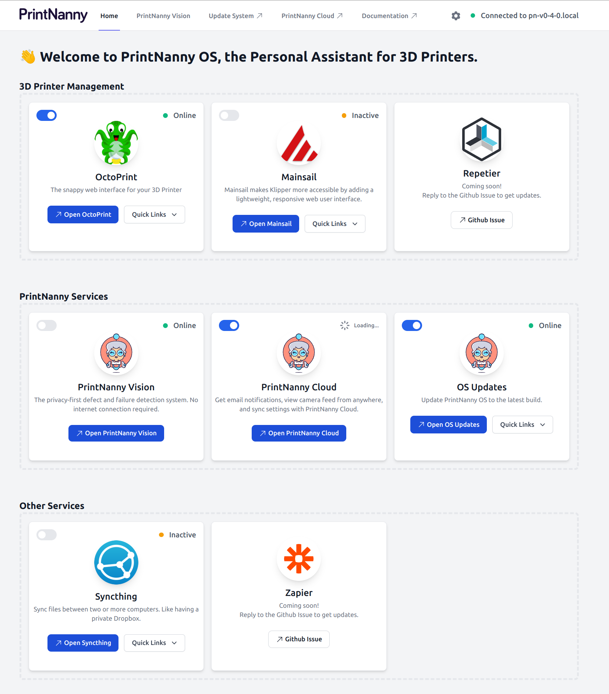
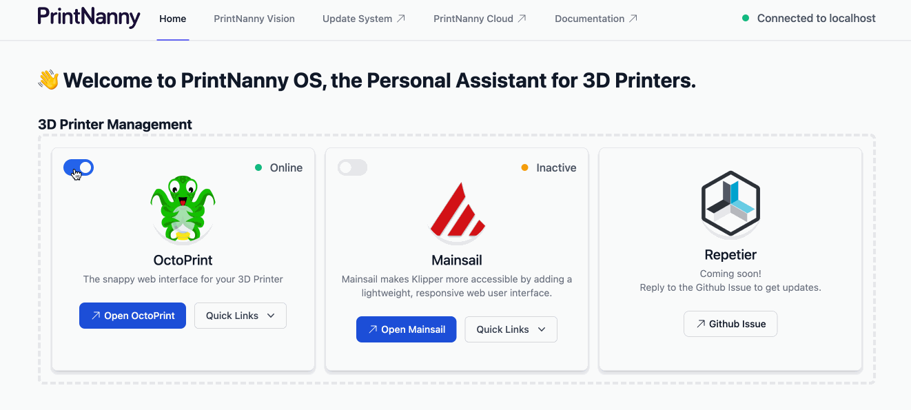
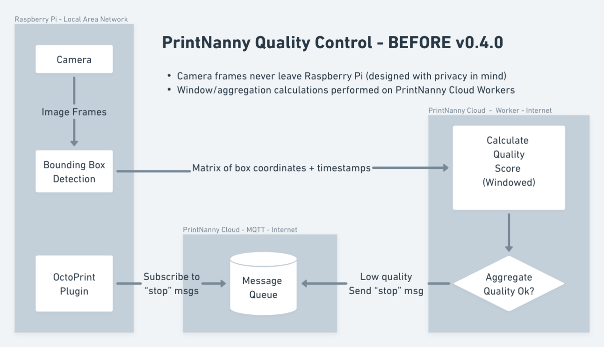
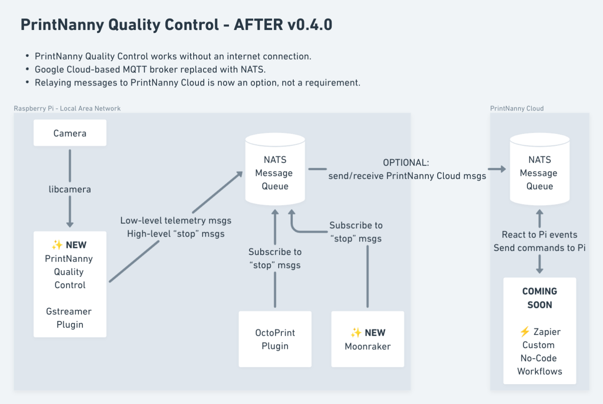

# v0.4.4 (Dunite Langdale)

:::info

PrintNanny OS is currently in closed Beta. 

[Join the waitlist](https://printnanny.ai/) to receive stress-test invitations and launch/development updates.

[Reserve your spot in the Founding Member program](https://printnanny.ai/shop/founding-membership), which grants you **immediate early access to PrintNanny for $149 USD.** A limited number of spots open after each release, available on a first-come, first-serve basis. 

Founding Members get access to a private Discord channel and unlimited use of PrintNanny services.
:::

## ⬇️ [Click to Download PrintNanny OS](https://github.com/bitsy-ai/printnanny-os/releases/tag/0.4.4)

* Follow the [Quick Start guide](https://docs.printnanny.ai/docs/category/quick-start/) to create a fresh PrintNanny OS installation.
* [Update a Raspberry Pi already running PrintNanny OS](https://docs.printnanny.ai/docs/update-printnanny-os/).

## ✨ What's New?

Dunite is the largest PrintNanny OS release to date! 

As usual, you can see detailed development updates in [Github's milestone tracker.](https://github.com/bitsy-ai/printnanny-os/milestone/4?closed=1) Exciting new updates include:

### PrintNanny OS Dashboard

PrintNanny OS now includes a "Mission Control" dashboard, which allows you to:

* Enable/disable installed services, like OctoPrint, Mainsail, Syncthing, and more.
* Update PrintNanny OS system.
* Inspect PrintNanny Vision performance in real-time.

.

[Join Discord](https://discord.gg/sf23bk2hPr) to let us know what we should add to the "Quick Links" navigation menus.

### Universal PrintNanny Image + Main

PrintNanny's "edition" images have been merged. 

Instead of installing a different OctoPrint vs. Mainsail image, you can seamlessly switch between MainSail/OctoPrint on the fly. Try both, and [Join Discord](https://discord.gg/sf23bk2hPr) to let us know whether you prefer OctoPrint, Mainsail, or some other controller software.

.

### PrintNanny Vision - now 100% offline

Before today, PrintNanny's Quality Control algorithm was split between the Raspberry Pi and remote server (see diagram below).

Starting with v0.4.0, PrintNanny Quality Control runs **entirely on the Raspberry Pi!**. No internet connection required!

With PrintNanny's privacy-first approach, the only time your camera data leaves your Raspberry Pi is when YOU start viewing your camera feed via PrintNanny Cloud Dashboard. PrintNanny Cloud allows you to issue commands or view your Raspberry Pi camera from anywhere in the world. PrintNanny will never upload your camera data as a "background" or "always on" monitoring process. 

This means PrintNanny Quality Control system can run without an internet connection, also known as an "air-gapped" system. 

#### Before v0.4.x

* Camera frames never leave Raspberry Pi (designed with privacy in mind).
* Detected object coordinates uploaded to remote server, where additional calculations are performed.

.

#### After v0.4.x

* PrintNanny Quality Control works without an internet connection.
* Google Cloud-based MQTT broker replaced with NATS. [Google announced shutdown of MQTT IoT Core service](https://techcrunch.com/2022/08/17/google-cloud-will-shutter-its-iot-core-service-next-year), so we re-built the message broker in the last release.
* Relaying messages to PrintNanny Cloud is now an option, not a requirement.

.

### Syncthing GA

[Syncthing](https://syncthing.net/) continuously synchronizes files between two or more devices - like a private DropBox. PrintNanny was conceived with privacy in mind, and Syncthing allows us to deliver easy file management without storing your files on our services. 

Follow the setup steps in [Configure File Sync](https://docs.printnanny.ai/docs/quick-start/configure-file-sync/) to get started. [Join Discord](https://discord.gg/sf23bk2hPr) to let us know what you think!
#
## Mainsail GA

Mainsail is now generally available in PrintNanny OS! Until now, you had to install a nightly dev build to use Mainsail/Moonraker/Klipper.

Follow the [Mainsail configuration guide](https://docs.mainsail.xyz/configuration) guide to configure `mainsail.cfg` and Klipper `printer.cfg` files.

### Other Updates

* Raspberry Pi disk usage available in PrintNanny Cloud dashboard.
* OctoPrint upgraded to 1.8.6 (from 1.8.2)
* Rustc upgraded to 1.63 (from 1.58)
* Python3 upgraded to 3.10.6 (from 3.9)
* Gstreamer upgraded to 1.20 (from 1.18)
* PrintNanny Linux distribution base now tracks [Yocto Langdale](https://wiki.yoctoproject.org/wiki/Releases). 

### 🐛 Bug Fixes

* Fixed an error installing OctoPrint plugins that depend on `cchardet`. [#97](https://github.com/bitsy-ai/printnanny-os/issues/97)
* PrintNanny Cloud dashboard no longer logs you out when an error is encountered [#73](https://github.com/bitsy-ai/printnanny-os/issues/73)

## Patch Releases

### v0.4.1

* Upgrade OpenSSL to version 3.0.7 to address [CVE-2022-3786 and CVE-2022-3602](https://www.openssl.org/blog/blog/2022/11/01/email-address-overflows/) in OpenSSL. [Read more @ printnanny.ai/blog](http://localhost:3002/blog/patch-openssl-security-vulnerability-across-hundreds-of-raspberry-pis/)

### v0.4.2

* PrintNanny Cloud services are now disabled by default, enabled only after PrintNanny Cloud account is connected. [#124](https://github.com/bitsy-ai/printnanny-os/issues/124)
* Fix a race condition when connecting PrintNanny Cloud account, resulting in `license.zip` not being written. [#125](https://github.com/bitsy-ai/printnanny-os/issues/125)
* Provision a default `moonraker.conf` file. Store moonraker and klipper application state in `/var/lib/moonraker` `/var/lib/klipper` [#104](https://github.com/bitsy-ai/printnanny-os/issues/104)

### v0.4.3

* Login to PrintNanny OS dashboard now persists after you close your browser. Previously, login was cleared when browser closed. [#134](https://github.com/bitsy-ai/printnanny-os/issues/134)
* Fixed PrintNanny OS dashboard `TypeError: cannot read properties of undefined (reading target)` [#135](https://github.com/bitsy-ai/printnanny-os/issues/135)
* PrintNanny OS dashboard is now built with source maps [#136](https://github.com/bitsy-ai/printnanny-os/issues/136)
* Fixed `Error resolving mDNS address` in Janus WebRTC Gateway [#137](https://github.com/bitsy-ai/printnanny-os/issues/137)

### v0.4.4

* Fixed a 400 bad request loading Mainsail themes [#146](https://github.com/bitsy-ai/printnanny-os/issues/146)
* Fixed error enabling Mainsail: invalid cross-device link [#141](https://github.com/bitsy-ai/printnanny-os/issues/141)
* Added PolicyKit rules for Moonraker privilege escalations. [#144](https://github.com/bitsy-ai/printnanny-os/issues/144). Moonraker should no longer display warnings/promps for sudo password. [#143](https://github.com/bitsy-ai/printnanny-os/issues/143)
