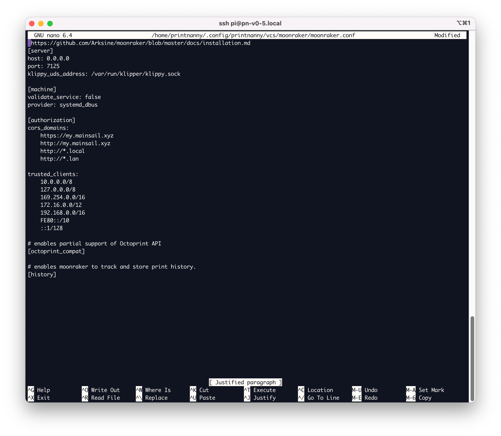

# v0.5.0 (Emerald Langdale)

:::info

PrintNanny OS is currently in closed Beta. 

[Join the waitlist](https://printnanny.ai/) to receive stress-test invitations and launch/development updates.

[Reserve your spot in the Founding Member program](https://printnanny.ai/shop/founding-membership), which grants you **early access to PrintNanny for $149 USD.** A limited number of spots open after each release, available on a first-come, first-serve basis. 
:::

## ⬇️ [Click to Download PrintNanny OS](https://github.com/bitsy-ai/printnanny-os/releases/tag/0.5.0)

* Follow the [Quick Start guide](https://docs.printnanny.ai/docs/category/quick-start/) to create a fresh PrintNanny OS installation.
* [Update a Raspberry Pi already running PrintNanny OS](https://docs.printnanny.ai/docs/update-printnanny-os/).

## ✨ What's New?

As usual, you can see detailed development updates in [Github's milestone tracker.](https://github.com/bitsy-ai/printnanny-os/milestone/5?closed=1). 

Exciting new updates in Emerald include:

### Tailscale Add-on

Tailscale is a Virtual Private Network (VPN) that lets you easily manage access to private resources, quickly SSH into devices on your network, and work securely from anywhere in the world.

Follow the [Tailscale Quick Start](https://printnanny.ai/docs/addons/tailscale/) guide to connect to your PrintNanny device from anywhere in the world.


### USB Camera Support

PrintNanny now supports USB cameras for monitoring your 3D printer. 🎦

You can now choose from all available CSI and USB cameras in PrintNanny's settings menu.

### Configure Camera Resolution & FPS

You can now select PrintNanny's resolution (width and height) and frames-per-second (FPS) in the settings menu:

.

### In-browser Settings Editor

OctoPrint, Klipper, Moonraker, and PrintNanny settings files can be tweaked striaght from your browser.

.

### Nano File Editor

If you prefer a terminal-based file editor, `nano` is now available. 

.

### Device Info

You can now see the contents of `/etc/issue` and `/etc/os-release` in the **Device Info** section of the settings menu.

.

### Password-less Login (PrintNanny Cloud)

The response to password-less login for PrintNanny OS was so positive, we've decided to do away with passwords everywhere. 

PrintNanny Cloud now uses a password-less login too. Enter your email address to receive a one-time login code.

.

### Crash Report

PrintNanny now includes a crash report utility, which can be accessed anytime by clicking the 🔥 icon in the top-right corner of Mission Control.

You can also submit a crash report from the command line, by running:

```bash
$ printnanny crash-report
```

.


### `tree` command

The `tree` command-line tool is now installed. `tree` recursively lists the contents of a directory:

.


## 🐛 Bug Fixes

* Fixed: New PrintNanny OS devices not always showing up in PrintNanny Cloud dash [#174](https://github.com/bitsy-ai/printnanny-os/issues/174)
* Fixed: Mooraker warning "supplied path for docs is invalid" [#148](https://github.com/bitsy-ai/printnanny-os/issues/148)
* Fixed: h264 camera framerate is choppy [#173](https://github.com/bitsy-ai/printnanny-os/issues/173)
* Fixed: refreshing PrintNanny OS dashboard results in a 404 [#161](https://github.com/bitsy-ai/printnanny-os/issues/161)

## 🛣️ Roadmap

2023 is going to be an exciting year for PrintNanny! 

Here's what's on the roadmap for Q1:

* Build no-code workflows and automation with Zapier [#100](https://github.com/bitsy-ai/printnanny-os/issues/100)
* Improvements + customizations for PrintNanny's AI detection detection system:
    * [#142 - Detect a Color Change](https://github.com/bitsy-ai/printnanny-os/issues/142)
    * [#140 - Calibration: Area of Interest](https://github.com/bitsy-ai/printnanny-os/issues/140)
    * [#139 - Calibration: Low ambient lighting](https://github.com/bitsy-ai/printnanny-os/issues/139)

* Store timelapse videos in PrintNanny Cloud


Most exciting of all, we're gearing up for the 🎊 public launch 🎊 of PrintNanny. Stay tuned for news about a fun launch party!

Thank you to everyone who has joined as a Founding Member during the beta! You'll keep unlimited access and special perks after launch.


:::info

PrintNanny OS is currently in closed Beta. 

[Join the waitlist](https://printnanny.ai/) to receive stress-test invitations and launch/development updates.

[Reserve your spot in the Founding Member program](https://printnanny.ai/shop/founding-membership), which grants you **early access to PrintNanny for $149 USD.** A limited number of spots open after each release, available on a first-come, first-serve basis. 
:::

## Patch Releases

### v0.5.1

[v0.5.1 Github Milestone](https://github.com/bitsy-ai/printnanny-os/milestone/11?closed=1)

* Added a crash dump utility which collects browser logs, system logs/status. See what's collected in [#185](https://github.com/bitsy-ai/printnanny-os/issues/185)
* Fixed: OctoPrint settings sync error [#187](https://github.com/bitsy-ai/printnanny-os/issues/187)
* Fixed: disk space errors when updating PrintNanny OS [#186](https://github.com/bitsy-ai/printnanny-os/issues/186)
* Fixed: broken Github Issue link [#184](https://github.com/bitsy-ai/printnanny-os/issues/184)