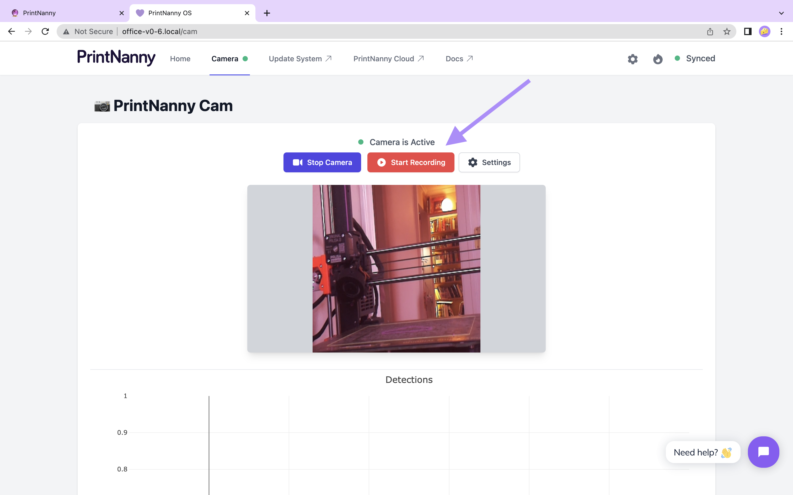
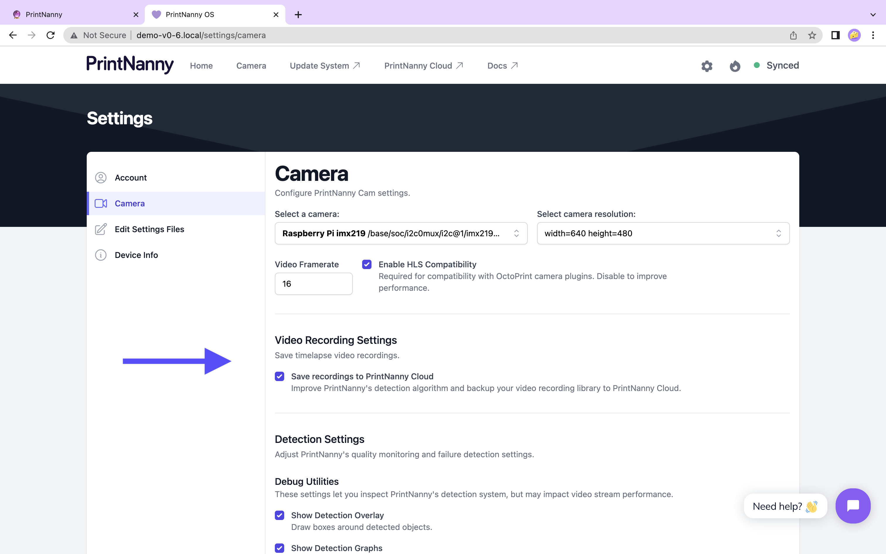

# v0.6.x (Feldspar Langdale)

:::info

PrintNanny OS is currently in closed Beta. 

[Join the waitlist](https://printnanny.ai/) to receive stress-test invitations and launch/development updates.

[Reserve your spot in the Founding Member program](https://printnanny.ai/shop/founding-membership), which grants you **early access to PrintNanny for $149 USD.** A limited number of spots open after each release, available on a first-come, first-serve basis. 
:::

## ⬇️ [Click to Download PrintNanny OS](https://github.com/bitsy-ai/printnanny-os/releases/tag/0.6.4)

* Follow the [Quick Start guide](https://docs.printnanny.ai/docs/category/quick-start/) to create a fresh PrintNanny OS installation.
* [Update a Raspberry Pi already running PrintNanny OS](https://docs.printnanny.ai/docs/update-printnanny-os/).

## ✨ What's New?

As usual, you can see detailed development updates in [Github's milestone tracker.](https://github.com/bitsy-ai/printnanny-os/milestone/6?closed=1) 

Exciting new updates in Emerald include:

### Timelapse Videos

You can now use PrintNanny to record videos in .mp4 format. Videos are automatically backed up to PrintNanny Cloud.

**To start a recording:**

1. Open PrintNanny OS Mission Control dashboard > Camera tab
2. Click/tap the **Start Recording** button.

.

3. Click/tap the **Stop Recording** button to end the recording.

.

**To manage automatic backups to PrintNanny Cloud:**

1. Open PrintNanny OS Mission Control dashboard > Settings menu (gear icon)
2. Click/tap the **Camera** settings tab.
3. Enable/disable **Save recordings to PrintNanny Cloud**
4. Click/tap the **Save** button to apply your settings.

.

:::tip

PrintNanny workflows are coming in v0.7.0 (Febuary 2023), which will support workflows like:

* When a print job starts, automatically start a recording
* When a critical failure is detected, pause the 3D printer job and then send an email link to the recording.
:::

## 🐛 Bug Fixes

* Fixed: network settings not getting applied [#207](https://github.com/bitsy-ai/printnanny-os/issues/207)
* Fixed: Crash Report zip - netstat_routes.txt is empty [#206](https://github.com/bitsy-ai/printnanny-os/issues/206)
* Fixed: colorblind accessibility in detection graph [#201](https://github.com/bitsy-ai/printnanny-os/issues/201)
* Fixed: HDMI audio codec crashes when no monitor is plugged in [#212](https://github.com/bitsy-ai/printnanny-os/issues/212)

## 🛣️ Roadmap

v0.7.0 is scheduled for February 2023, with an exciting preview of no-code workflows for your 3D printer farm.

You'll be able to create custom workflows, starting with PrintNanny's alert system. Stay tuned for exciting updates, like integration with [Zapier](https://github.com/bitsy-ai/printnanny-os/issues/100).

:::info

PrintNanny OS is currently in closed Beta. 

[Join the waitlist](https://printnanny.ai/) to receive stress-test invitations and launch/development updates.

[Reserve your spot in the Founding Member program](https://printnanny.ai/shop/founding-membership), which grants you **early access to PrintNanny for $149 USD.** A limited number of spots open after each release, available on a first-come, first-serve basis. 
:::

## Patch Releases

### v0.6.1

[v0.6.1 Github Milestone](https://github.com/bitsy-ai/printnanny-os/milestone/13?closed=1)

* New: JPEG camera snapahots now available @ `http://<hostname>/printnanny-snapshot/jpeg` 
* New: OctoPrint / Moonraker now pre-configured with snapshot urls [#210](https://github.com/bitsy-ai/printnanny-os/issues/210) [#211](https://github.com/bitsy-ai/printnanny-os/issues/211)
* Fixed: Submitting a browser crash report sometimes failed with error: `Converting circular structure to JSON` [#218](https://github.com/bitsy-ai/printnanny-os/issues/218)
* Fixed: printnanny-cloud-sync.service failed to start [#222](https://github.com/bitsy-ai/printnanny-os/issues/222)
* Fixed: Raspberry Pis with the hostname `printnanny` unable to connect to PrintNanny Cloud & receive remote commands (NATS messages) [#225](https://github.com/bitsy-ai/printnanny-os/issues/225)
* Fixed: OctoPrint compatibility with Python 3.11 [#223](https://github.com/bitsy-ai/printnanny-os/issues/223)
* Changed: decreased log verbosity and stripped ascii colors from gstd.service logs. [#221](https://github.com/bitsy-ai/printnanny-os/issues/221)
  
### v0.6.2

[v0.6.2 Github Milestone](https://github.com/bitsy-ai/printnanny-os/milestone/14?closed=1)

* New: Files written to `/etc` now persist through PrintNanny OS upgrades, just like files written to `/home`.
* New: Mission Control dashboard will now show a "PrintNanny is starting up..." message if services are not ready. [#220](https://github.com/bitsy-ai/printnanny-os/issues/220)
* New: OctoPrint logs are now included in PrintNanny's crash report system. [#231](https://github.com/bitsy-ai/printnanny-os/issues/231)
* New: `blkid` command-line utility is now available [#234](https://github.com/bitsy-ai/printnanny-os/issues/234)
* Fixed: OctoPrint plugin manager error: "the pip command could not be found or does not work correctly for this installation of OctoPrint" [#229](https://github.com/bitsy-ai/printnanny-os/issues/229)
* Fixed: Settings editor was missing `printer.cfg` and showed duplicate `moonraker.conf` files [#228](https://github.com/bitsy-ai/printnanny-os/issues/228)
* Fixed: PrintNanny camera settings incorrectly shows IMX219 camera in drop-down menu when only USB camera is connected [#219](https://github.com/bitsy-ai/printnanny-os/issues/219)
* Fixed: Video stream did not free resources on shutdown, leading to errors on next start [#232](https://github.com/bitsy-ai/printnanny-os/issues/232)

### v0.6.3

[v0.6.3 Github Milestone](https://github.com/bitsy-ai/printnanny-os/milestone/15?closed=1)

* Fixed: NATS 503 error on Raspberry Pis with capital letter in hostname, e.g. `raspberryPi` [#238](https://github.com/bitsy-ai/printnanny-os/issues/238)
* Fixed: `printnanny-cloud-nats.service` fails to start with error: Record not found [#236](https://github.com/bitsy-ai/printnanny-os/issues/236)
* Chore: filter spammy `h264parse` element logs in Gstreamer daemon service [#237](https://github.com/bitsy-ai/printnanny-os/issues/237)

### v0.6.4

[v0.6.4 Github Milestone](https://github.com/bitsy-ai/printnanny-os/milestone/17?closed=1)

* Fixed: OctoPrint fails to load PrintNanny Cloud data [#248](https://github.com/bitsy-ai/printnanny-os/issues/248)
* Fixed: PrintNanny Cam shows incorrect aspect ratio [#244](https://github.com/bitsy-ai/printnanny-os/issues/244)
* Fixed: crash-report command sometimes returns error: No such file or directory [#249](https://github.com/bitsy-ai/printnanny-os/issues/249)
* New: removed zoom/pan controls from detection graph [#245](https://github.com/bitsy-ai/printnanny-os/issues/245)

### v0.6.5

[v0.6.5 Github Milestone](https://github.com/bitsy-ai/printnanny-os/milestone/18?closed=1)

* New: PrintNanny OS version shown in Mission Control footer [#269](https://github.com/bitsy-ai/printnanny-os/issues/269)
* Fixed: Camera service is stopped when navigating away from camera page [#265](https://github.com/bitsy-ai/printnanny-os/issues/265)
* Fixed: NatsError: TIMEOUT when saving camera settings [#266](https://github.com/bitsy-ai/printnanny-os/issues/265)
* Fixed: System time gets reset on reboot [#267](https://github.com/bitsy-ai/printnanny-os/issues/267)
* Fixed: Camera status indicator is only visible from the camera page [#268](https://github.com/bitsy-ai/printnanny-os/issues/268)
* Fixed: Bounding box overlay is not rendered in WebRTC camera stream [#270](https://github.com/bitsy-ai/printnanny-os/issues/270)
* Fixed "Start Recording" button shown when camera is already recording [#271](https://github.com/bitsy-ai/printnanny-os/issues/271)