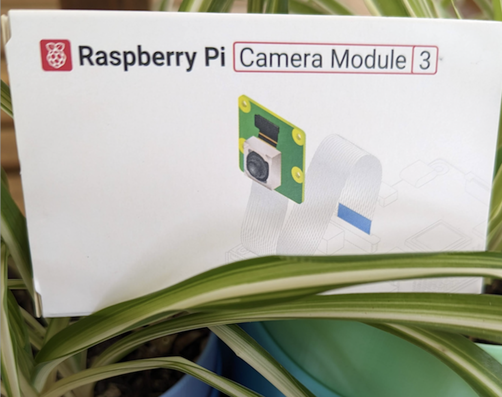
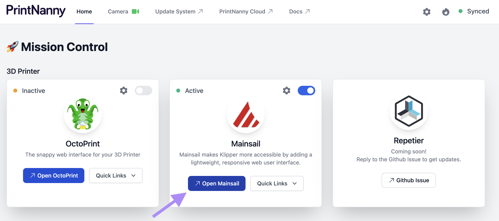
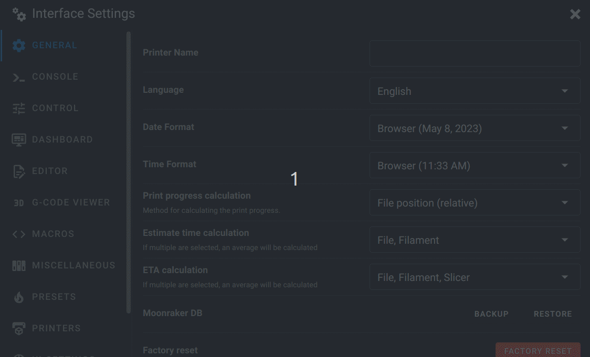
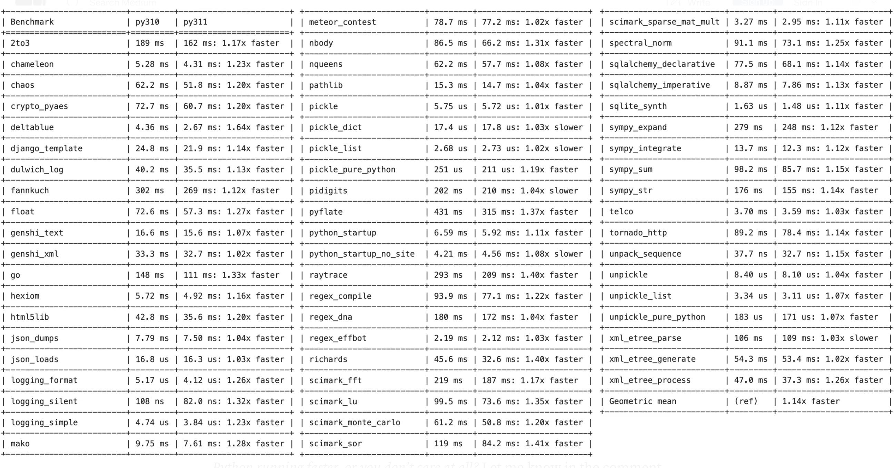

# v0.7.x (Garnet Mickledore)

:::info

[Raspberry Pi 4 kits are now available in the United States.](https://printnanny.ai/shop/raspberry-pi-4-kit)

The kit includes everything you need to get started with PrintNanny.
:::

## ⬇️ [Click to Download PrintNanny OS](https://github.com/bitsy-ai/printnanny-os/releases/tag/0.7.0)

* Follow the [Quick Start guide](https://docs.printnanny.ai/docs/category/quick-start/) to create a fresh PrintNanny OS installation.
* [Update a Raspberry Pi already running PrintNanny OS](https://docs.printnanny.ai/docs/update-printnanny-os/).

## ✨ What's New?

### Raspberry Pi Camera v3

We're stoked to add support for the RPI Camera Module v3, which packs 12-megapixel IMX708 camera sensor with auto-focus.

.


### Mainsail Camera Support

You can now view PrintNanny's camera feed directly in Mainsail's UI.

Follow the steps below to add your camera:

1. Use the PrintNanny OS dashboard to open Mainsail

.

2. In the Mainsail dashboard, click the gear icon ⚙️ to open Mainsail's settings menu.

3. In the left-hand side of the menu, open the **Webcams** menu section.

4. Save the following webcam settings:

```
Name: <camera name, PrintNannyCam in the example below>
URL Stream: /printnanny-hls/playlist.m3u8
URL Snapshot: /printnanny-snapshot/jpeg
```

.

### Python 3.11 - So Fast!

Klipper, Moonraker, and OctoPrint are now running on Python 3.11 (previously 3.10).

On average, we expect to see a 1.25x speedup in everyday OctoPrint and Klipper/Moonraker operations. That's a significant performance boost, especially for a Raspberry Pi! 

Benchmarks from: [Python is About to Become 64% Faster — Python 3.10 vs. Python 3.11 Benchmark](https://towardsdatascience.com/python-is-about-to-become-64-faster-python-3-10-vs-python-3-11-benchmark-3a6abcc25b90)


