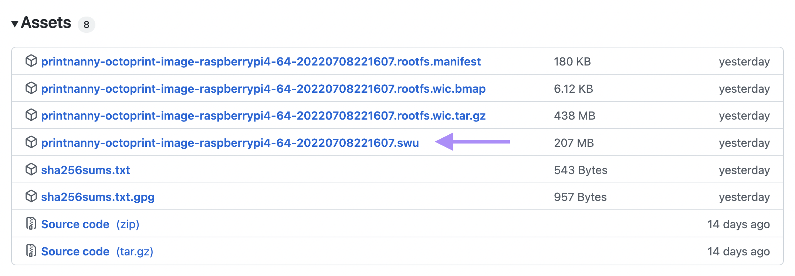
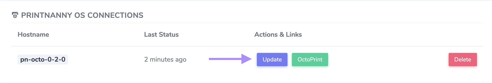
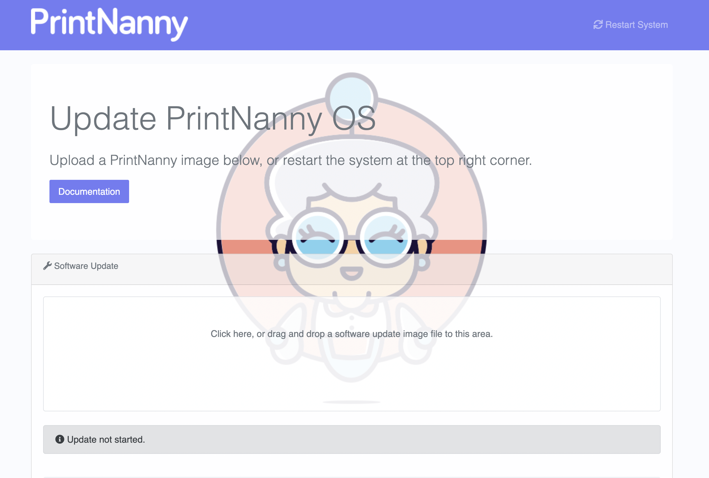
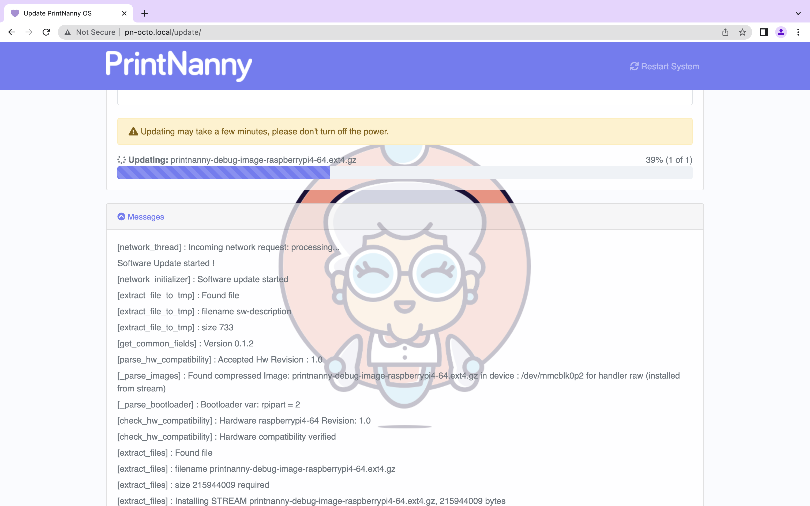

# Update PrintNanny OS

:::info

Check this doc each time you upgrade PrintNanny OS. 

The directions are subject to change during the Beta.
:::

PrintNanny OS can be updated in place, which means you don't have to re-image your SD card to enjoy the latest features.

## 1. Download `.swu` update file

Browse to [the releases page](https://github.com/bitsy-ai/printnanny-os/releases) and download the latest `.swu` file.

## 2. Browse to [PrintNanny Cloud Dashboard](https://printnanny.ai/dashboard/).

## Click the "Update" button to open device update UI.

## 3. Click or drag/drop the `.swu` file into the update UI

## 4. Wait for the update to finish

